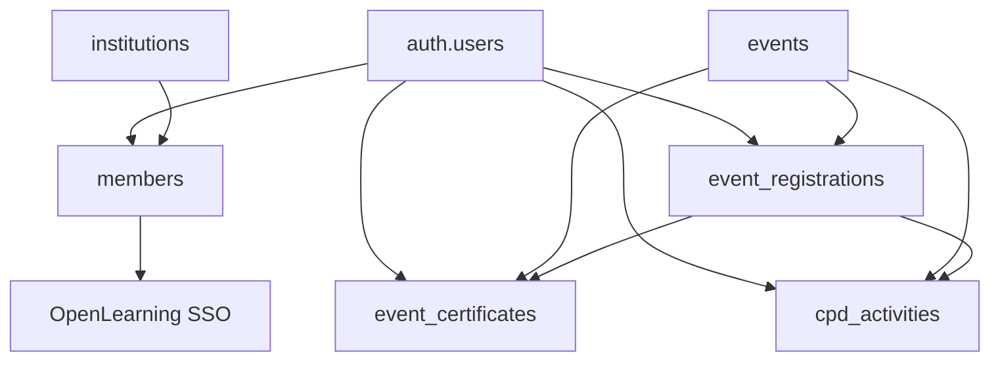

# 📊 DATABASE SCHEMA DOCUMENTATION - EAU SYSTEM

**Last Updated:** 31 October 2025 (Institution Linking Feature Added)
**Database:** Supabase PostgreSQL
**URL:** https://english-australia-eau-supabase.lkobs5.easypanel.host

## ⚠️ CRITICAL: HOW TO USE THIS DOCUMENT

### MANDATORY WORKFLOW:
1. **BEFORE ANY SQL**: ALWAYS read this document first
2. **AFTER ANY ALTER/CREATE**: IMMEDIATELY update this document
3. **NEVER assume column names** - check the exact structure below
4. **Run `extract-database-schema.sql`** to get latest structure

### UPDATE PROCESS:
When you ALTER TABLE or CREATE TABLE:
1. Execute your SQL changes
2. Run `extract-database-schema.sql` 
3. Update this document with new structure
4. Commit both the SQL and this documentation
5. Note the change in the "Last Updated" field at top

---

## 📋 TABLE OF CONTENTS

1. [Core Tables](#core-tables)
2. [Quick Reference](#quick-reference)
3. [Relationships](#relationships)
4. [Common SQL Templates](#common-sql-templates)

---

## 🗂️ CORE TABLES

### 1. **events**
Primary table for all events in the system.

```sql
-- EXACT STRUCTURE FROM DATABASE
CREATE TABLE events (
    id UUID PRIMARY KEY,
    title VARCHAR NOT NULL,
    slug VARCHAR NOT NULL,
    description TEXT,
    short_description VARCHAR,
    image_url TEXT,
    category_id UUID,
    start_date TIMESTAMP WITH TIME ZONE NOT NULL,
    end_date TIMESTAMP WITH TIME ZONE NOT NULL,
    timezone VARCHAR,
    location_type VARCHAR,        -- Use this instead of 'format'
    venue_name VARCHAR,
    address_line1 VARCHAR,
    address_line2 VARCHAR,
    city VARCHAR,
    state VARCHAR,
    postal_code VARCHAR,
    country VARCHAR,
    virtual_link TEXT,            -- For online events
    location_instructions TEXT,
    capacity INTEGER,              -- Use this instead of max_participants
    waitlist_enabled BOOLEAN,
    registration_start_date TIMESTAMP WITH TIME ZONE,
    registration_end_date TIMESTAMP WITH TIME ZONE,  -- This is the registration deadline
    member_price_cents INTEGER,
    non_member_price_cents INTEGER,
    early_bird_price_cents INTEGER,
    early_bird_end_date TIMESTAMP WITH TIME ZONE,
    cpd_points NUMERIC,
    cpd_category VARCHAR,
    status VARCHAR,
    visibility VARCHAR,
    featured BOOLEAN,
    created_by UUID,
    created_at TIMESTAMP WITH TIME ZONE,
    updated_at TIMESTAMP WITH TIME ZONE,
    published_at TIMESTAMP WITH TIME ZONE,
    cancelled_at TIMESTAMP WITH TIME ZONE,
    cancellation_reason TEXT,
    allow_guests BOOLEAN,
    max_guests_per_registration INTEGER,
    requires_approval BOOLEAN,
    show_attendee_list BOOLEAN,
    meta_title VARCHAR,
    meta_description VARCHAR,
    tags TEXT[],
    custom_fields JSONB,
    settings JSONB
);
```

**Key Points:**
- ✅ Use `location_type` instead of 'format'
  - **VALID VALUES:** `'physical'`, `'virtual'`, `'hybrid'` (CHECK constraint enforced!)
- ✅ Use `capacity` instead of 'max_participants'
- ✅ Use `virtual_link` for online events
- ✅ Use `registration_end_date` as registration deadline
- ✅ Use `venue_name` + address fields for location

**⚠️ IMPORTANT CONSTRAINTS:**
- `location_type` MUST be one of: `'physical'`, `'virtual'`, `'hybrid'`
- `status` commonly uses: `'published'`, `'draft'`, `'cancelled'`

### 2. **event_registrations**
Links users to events they've registered for.

```sql
-- EXACT STRUCTURE (Update after running extract-database-schema.sql)
CREATE TABLE event_registrations (
    id UUID PRIMARY KEY DEFAULT gen_random_uuid(),
    event_id UUID NOT NULL REFERENCES events(id) ON DELETE CASCADE,
    user_id UUID NOT NULL REFERENCES auth.users(id) ON DELETE CASCADE,
    registration_date TIMESTAMP WITH TIME ZONE DEFAULT NOW(),
    status VARCHAR(50) DEFAULT 'pending',
    attended BOOLEAN DEFAULT false,
    checked_in BOOLEAN DEFAULT false,
    check_in_date TIMESTAMP WITH TIME ZONE,
    payment_status VARCHAR(50),
    payment_amount DECIMAL(10,2),
    certificate_issued BOOLEAN DEFAULT false,
    certificate_issued_date TIMESTAMP WITH TIME ZONE,
    certificate_number VARCHAR(100),
    cpd_activity_created BOOLEAN DEFAULT false,
    cpd_activity_id UUID REFERENCES cpd_activities(id),
    certificate_url TEXT,
    pdf_url TEXT,
    notes TEXT,
    created_at TIMESTAMP WITH TIME ZONE DEFAULT NOW(),
    updated_at TIMESTAMP WITH TIME ZONE DEFAULT NOW(),
    UNIQUE(event_id, user_id)
);
```

**Key Points:**
- ✅ `attended` OR `checked_in` = true means eligible for certificate
- ✅ `certificate_issued` tracks if certificate was generated
- ✅ `cpd_activity_created` tracks if CPD points were added

### 3. **cpd_activities**
Tracks all CPD (Continuing Professional Development) activities.

```sql
-- EXACT STRUCTURE (Update after running extract-database-schema.sql)
CREATE TABLE cpd_activities (
    id UUID PRIMARY KEY DEFAULT gen_random_uuid(),
    user_id UUID NOT NULL REFERENCES auth.users(id),
    activity_type VARCHAR(100) NOT NULL,
    activity_title VARCHAR(500) NOT NULL,
    activity_date DATE NOT NULL,
    cpd_points INTEGER NOT NULL DEFAULT 1,
    cpd_category VARCHAR(200),
    description TEXT,
    provider VARCHAR(500),
    certificate_number VARCHAR(100),
    certificate_url TEXT,
    event_id UUID REFERENCES events(id),
    status VARCHAR(50) DEFAULT 'pending',
    approved_by UUID REFERENCES auth.users(id),
    approved_date TIMESTAMP WITH TIME ZONE,
    rejection_reason TEXT,
    evidence_url TEXT,
    created_at TIMESTAMP WITH TIME ZONE DEFAULT NOW(),
    updated_at TIMESTAMP WITH TIME ZONE DEFAULT NOW()
);
```

### 4. **cpd_categories** ⭐ NEW (Added 31/10/2025)
Master table for CPD activity categories with points per hour calculation.

```sql
-- EXACT STRUCTURE (Created via migration 31/10/2025)
CREATE TABLE cpd_categories (
    id SERIAL PRIMARY KEY,
    name TEXT NOT NULL UNIQUE,
    points_per_hour INTEGER NOT NULL CHECK (points_per_hour IN (1, 2, 3)),
    description TEXT,
    is_active BOOLEAN DEFAULT true,
    created_at TIMESTAMPTZ DEFAULT now(),
    updated_at TIMESTAMPTZ DEFAULT now()
);
```

**Key Points:**
- ✅ Contains 17 standardized CPD categories
- ✅ `points_per_hour` determines automatic points calculation: `cpd_points = hours × points_per_hour`
- ✅ Valid values: 1, 2, or 3 points per hour (CHECK constraint enforced)
- ✅ Used by frontend dropdown to show category options
- ✅ Backend API endpoint: `GET /api/v1/cpd/categories`

**Implementation Details:**
- **Sprint 1 - CPD Categories** (Completed 31/10/2025)
- **Frontend:** `AddCPDActivityModal.tsx` loads categories from API
- **Backend:** `cpd.controller.ts` provides `getCPDCategories()` endpoint
- **Points Calculation:** Automatic when creating CPD activity via API
- **Fallback:** Frontend has hardcoded categories if API fails

**Categories (17 total):**
1. Learning Circle Interactive Course (1 pt/hr)
2. Mentor TESOL teacher (1 pt/hr)
3. Attend industry webinar (1 pt/hr)
4. Attend industry PD event (1 pt/hr)
5. Attend English Australia PD event (1 pt/hr)
6. Present at industry event (2 pt/hr)
7. Attend in-house PD or Training event (1 pt/hr)
8. Present at in-house PD event (2 pt/hr)
9. Attend English Australia webinar (1 pt/hr)
10. Watch recorded webinar (1 pt/hr)
11. Peer-observe someone's lesson (1 pt/hr)
12. Be observed teaching (1 pt/hr)
13. Complete professional course (1 pt/hr)
14. Attend Industry Training (1 pt/hr)
15. Read journal article (1 pt/hr)
16. Read professional article (1 pt/hr)
17. ELICOS teaching (2 pt/hr)

### 5. **event_certificates**
Stores generated certificates for events.

```sql
-- EXACT STRUCTURE (Update after running extract-database-schema.sql)
CREATE TABLE event_certificates (
    id UUID PRIMARY KEY DEFAULT gen_random_uuid(),
    registration_id UUID NOT NULL REFERENCES event_registrations(id),
    event_id UUID NOT NULL REFERENCES events(id),
    user_id UUID NOT NULL REFERENCES auth.users(id),
    certificate_number VARCHAR(50) NOT NULL UNIQUE,
    issue_date TIMESTAMP WITH TIME ZONE NOT NULL DEFAULT NOW(),
    recipient_name VARCHAR(255) NOT NULL,
    event_title VARCHAR(500) NOT NULL,
    event_date VARCHAR(50) NOT NULL,
    cpd_points INTEGER DEFAULT 1,
    cpd_category VARCHAR(100),
    pdf_url TEXT,
    pdf_generated BOOLEAN DEFAULT false,
    is_valid BOOLEAN DEFAULT true,
    created_at TIMESTAMP WITH TIME ZONE DEFAULT NOW(),
    updated_at TIMESTAMP WITH TIME ZONE DEFAULT NOW()
);
```

### 5. **institutions**
Organizations that members belong to.

```sql
-- EXACT STRUCTURE (Update after running extract-database-schema.sql)
CREATE TABLE institutions (
    id UUID PRIMARY KEY DEFAULT gen_random_uuid(),
    name VARCHAR(500) NOT NULL,
    code VARCHAR(100) UNIQUE,
    email VARCHAR(255),
    phone VARCHAR(50),
    website VARCHAR(500),
    address TEXT,
    city VARCHAR(200),
    state VARCHAR(100),
    country VARCHAR(100) DEFAULT 'Australia',
    postal_code VARCHAR(20),
    membership_type VARCHAR(100),
    membership_status VARCHAR(50) DEFAULT 'active',
    membership_start_date DATE,
    membership_renewal_date DATE,
    membership_fee_amount DECIMAL(10,2),
    membership_fee_gst DECIMAL(10,2),
    membership_fee_total DECIMAL(10,2),
    created_at TIMESTAMP WITH TIME ZONE DEFAULT NOW(),
    updated_at TIMESTAMP WITH TIME ZONE DEFAULT NOW()
);
```

### 6. **members**
Members of institutions and organizations.

```sql
-- EXACT STRUCTURE (Updated 31/10/2025)
CREATE TABLE members (
    id UUID PRIMARY KEY DEFAULT gen_random_uuid(),
    email VARCHAR(255) NOT NULL,
    first_name VARCHAR(255),
    last_name VARCHAR(255),
    phone VARCHAR(50),
    job_title VARCHAR(255),
    department VARCHAR(255),
    institution_id UUID REFERENCES institutions(id),
    user_id UUID REFERENCES auth.users(id), -- ✅ AGORA TODOS TÊM!
    created_by UUID,
    membership_type VARCHAR(100),
    membership_status VARCHAR(50) DEFAULT 'active',
    membership_start_date DATE,
    membership_end_date DATE,
    user_type VARCHAR(50), -- 'super_admin', 'admin', 'staff', etc
    welcome_email_sent TIMESTAMP WITH TIME ZONE,
    openlearning_user_id VARCHAR(255),
    openlearning_external_id VARCHAR(255),
    openlearning_provisioned_at TIMESTAMP WITH TIME ZONE,
    institution_linked_at TIMESTAMPTZ, -- ⭐ NEW: When institution link was approved
    institution_linked_by UUID REFERENCES members(id), -- ⭐ NEW: Admin who approved link
    created_at TIMESTAMP WITH TIME ZONE DEFAULT NOW(),
    updated_at TIMESTAMP WITH TIME ZONE DEFAULT NOW()
);
```

**⚠️ IMPORTANTE (19/01/2025):**
- **TODOS os membros agora têm `user_id`** vinculado ao auth.users
- **Senha padrão de desenvolvimento**: `EAU2025temp!`
- **Total de membros com login**: 5575 (100%)
- **OpenLearning SSO Implementado**: Campos `openlearning_user_id`, `openlearning_external_id` e `openlearning_provisioned_at` usados para SSO
- **Sincronização de certificados CANCELADA**: Campos `openlearning_sync_*` removidos

### 7. **profiles** (NOTA: TABELA NÃO EXISTE MAIS)
⚠️ **IMPORTANTE**: A tabela `profiles` foi removida do sistema. As informações de perfil estão armazenadas em:
- **auth.users**: raw_user_meta_data contém full_name e role
- **members**: contém todas as informações detalhadas do membro

### 8. **password_reset_tokens**
Tokens for password reset and welcome emails.

```sql
-- EXACT STRUCTURE (Added 12/09/2025)
CREATE TABLE password_reset_tokens (
    id UUID PRIMARY KEY DEFAULT gen_random_uuid(),
    user_id UUID REFERENCES auth.users(id) ON DELETE CASCADE,
    email VARCHAR(255) NOT NULL,
    token VARCHAR(255) UNIQUE NOT NULL,
    expires_at TIMESTAMP WITH TIME ZONE NOT NULL,
    used BOOLEAN DEFAULT false,
    type VARCHAR(50) DEFAULT 'reset', -- 'reset' or 'welcome'
    created_at TIMESTAMP WITH TIME ZONE DEFAULT NOW(),
    used_at TIMESTAMP WITH TIME ZONE
);
```

### 9. **email_logs**
Logs of all emails sent by the system.

```sql
-- EXACT STRUCTURE (Added 12/09/2025)
CREATE TABLE email_logs (
    id UUID PRIMARY KEY DEFAULT gen_random_uuid(),
    user_id UUID REFERENCES auth.users(id),
    recipient_email VARCHAR(255) NOT NULL,
    email_type VARCHAR(50) NOT NULL, -- 'welcome', 'reminder', 'notification', etc
    sent_at TIMESTAMP WITH TIME ZONE NOT NULL,
    status VARCHAR(20) DEFAULT 'sent', -- 'sent', 'failed', 'bounced'
    error_message TEXT,
    metadata JSONB,
    created_at TIMESTAMP WITH TIME ZONE DEFAULT NOW()
);
```

### 10. **membership_applications**
Applications for new memberships.

```sql
-- EXACT STRUCTURE (Added 11/09/2025)
CREATE TABLE membership_applications (
    id UUID PRIMARY KEY DEFAULT gen_random_uuid(),
    institution_name VARCHAR(255) NOT NULL,
    contact_person_email VARCHAR(255) NOT NULL,
    membership_type VARCHAR(50) NOT NULL,
    application_data JSONB NOT NULL,  -- Stores all application form data
    status VARCHAR(20) NOT NULL DEFAULT 'pending',  -- pending, under_review, approved, rejected
    submitted_at TIMESTAMPTZ NOT NULL DEFAULT NOW(),
    reviewed_at TIMESTAMPTZ,
    reviewed_by UUID REFERENCES auth.users(id),
    review_notes TEXT,
    approved_at TIMESTAMPTZ,
    rejected_at TIMESTAMPTZ,
    created_at TIMESTAMPTZ DEFAULT NOW(),
    updated_at TIMESTAMPTZ DEFAULT NOW()
);
```

### 11. **membership_fees**
Membership fee structure.

```sql
-- EXACT STRUCTURE (Added 11/09/2025)
CREATE TABLE membership_fees (
    id UUID PRIMARY KEY DEFAULT gen_random_uuid(),
    membership_type VARCHAR(50) UNIQUE NOT NULL,
    display_name VARCHAR(100) NOT NULL,
    base_fee_cents INTEGER NOT NULL,
    gst_rate DECIMAL(4,2) DEFAULT 0.10, -- 10% GST
    description TEXT,
    benefits JSONB,
    is_active BOOLEAN DEFAULT true,
    created_at TIMESTAMPTZ DEFAULT NOW(),
    updated_at TIMESTAMPTZ DEFAULT NOW()
);
```

### 12. **openlearning_sync_logs**
Logs for OpenLearning synchronization operations.

```sql
-- EXACT STRUCTURE (Added 15/09/2025)
CREATE TABLE openlearning_sync_logs (
    id UUID PRIMARY KEY DEFAULT gen_random_uuid(),
    sync_type VARCHAR(50) NOT NULL CHECK (sync_type IN ('scheduled', 'manual', 'webhook')),
    started_at TIMESTAMP WITH TIME ZONE NOT NULL DEFAULT NOW(),
    completed_at TIMESTAMP WITH TIME ZONE,
    status VARCHAR(50) NOT NULL DEFAULT 'running' CHECK (status IN ('running', 'completed', 'failed')),
    members_processed INTEGER DEFAULT 0,
    courses_imported INTEGER DEFAULT 0,
    cpd_activities_created INTEGER DEFAULT 0,
    execution_time_ms INTEGER,
    error_message TEXT,
    result JSONB,
    created_at TIMESTAMP WITH TIME ZONE DEFAULT NOW()
);
```

### 13. **openlearning_courses**
Courses imported from OpenLearning platform.

```sql
-- EXACT STRUCTURE (Added 15/09/2025)
CREATE TABLE openlearning_courses (
    id UUID PRIMARY KEY DEFAULT gen_random_uuid(),
    member_id UUID NOT NULL REFERENCES members(id) ON DELETE CASCADE,
    openlearning_course_id VARCHAR(255) NOT NULL,
    openlearning_class_id VARCHAR(255),
    course_name VARCHAR(500),
    course_description TEXT,
    completion_date TIMESTAMP WITH TIME ZONE,
    completion_percentage INTEGER DEFAULT 100,
    certificate_url TEXT,
    cpd_activity_id UUID REFERENCES cpd_activities(id) ON DELETE SET NULL,
    raw_data JSONB,
    synced_at TIMESTAMP WITH TIME ZONE DEFAULT NOW(),
    created_at TIMESTAMP WITH TIME ZONE DEFAULT NOW(),
    UNIQUE(member_id, openlearning_course_id, openlearning_class_id)
);
```

### 14. **openlearning_api_logs**
API call logs for OpenLearning integration.

```sql
-- EXACT STRUCTURE (Added 15/09/2025)
CREATE TABLE openlearning_api_logs (
    id UUID PRIMARY KEY DEFAULT gen_random_uuid(),
    member_id UUID REFERENCES members(id) ON DELETE CASCADE,
    action VARCHAR(100) NOT NULL,
    endpoint VARCHAR(255) NOT NULL,
    request_data JSONB,
    response_data JSONB,
    status_code INTEGER,
    error_message TEXT,
    created_at TIMESTAMP WITH TIME ZONE DEFAULT NOW()
);
```

### 15. **openlearning_sso_sessions**
SSO sessions for OpenLearning integration.

```sql
-- EXACT STRUCTURE (Added 18/01/2025)
CREATE TABLE openlearning_sso_sessions (
    id UUID PRIMARY KEY DEFAULT gen_random_uuid(),
    member_id UUID NOT NULL REFERENCES members(id) ON DELETE CASCADE,
    openlearning_user_id VARCHAR(255),
    session_token VARCHAR(500) NOT NULL,
    external_id VARCHAR(255),
    expires_at TIMESTAMP WITH TIME ZONE NOT NULL,
    last_accessed TIMESTAMP WITH TIME ZONE,
    metadata JSONB,
    created_at TIMESTAMP WITH TIME ZONE DEFAULT NOW(),
    UNIQUE(session_token)
);
```

### 16. **institution_link_requests** ⭐ NEW (Added 31/10/2025)
Manages member requests to link with institutions. Allows members to request institutional affiliation, with admin approval workflow.

```sql
-- EXACT STRUCTURE (Created via migration 31/10/2025)
CREATE TABLE institution_link_requests (
    id UUID PRIMARY KEY DEFAULT gen_random_uuid(),
    member_id UUID NOT NULL REFERENCES members(id) ON DELETE CASCADE,
    institution_id UUID NOT NULL REFERENCES institutions(id) ON DELETE CASCADE,
    status TEXT NOT NULL DEFAULT 'pending' CHECK (status IN ('pending', 'approved', 'rejected')),
    requested_at TIMESTAMPTZ NOT NULL DEFAULT now(),
    reviewed_by UUID REFERENCES members(id),
    reviewed_at TIMESTAMPTZ,
    review_notes TEXT,
    created_at TIMESTAMPTZ DEFAULT now(),
    updated_at TIMESTAMPTZ DEFAULT now()
);

-- Unique constraint: only one pending request per member
CREATE UNIQUE INDEX idx_unique_pending_request
    ON institution_link_requests(member_id)
    WHERE status = 'pending';
```

**Key Points:**
- ✅ Enforces **one pending request per member** via unique partial index
- ✅ Status: `'pending'`, `'approved'`, `'rejected'` (CHECK constraint)
- ✅ Tracks reviewer and review timestamp
- ✅ Email notifications sent on request/approval/rejection
- ✅ On approval: Updates `members.institution_id` + audit fields

**Implementation Details:**
- **Sprint 1 - Week 2 - Institution Linking** (Completed 31/10/2025)
- **Backend Service:** `institutionLink.service.ts` - Complete workflow logic
- **Backend Controller:** `institutionLink.controller.ts` - 7 REST endpoints
- **Backend Routes:** `POST /api/v1/institution-links/request`, `/approve`, `/reject`, etc.
- **Frontend (Members):** `InstitutionLinkPage.tsx` - Request and view status
- **Frontend (Admins):** `InstitutionLinkRequestsPage.tsx` - Review and approve/reject
- **Email Notifications:** Automatic at each workflow step (request, approval, rejection)

**Workflow:**
1. Member selects institution and submits request
2. All institution admins receive email notification
3. Admin reviews request and approves/rejects (notes required for rejection)
4. Member receives email with decision
5. On approval: `members.institution_id`, `institution_linked_at`, `institution_linked_by` updated
6. Member can unlink anytime (resets fields to NULL)

**RLS Policies:**
- **View Own Requests**: Members can view their own requests
- **View Institution Requests**: Admins can view requests for their institution
- **Create Request**: Authenticated members can create requests
- **Update Request**: Only admins can update (approve/reject)

---

## 🚀 QUICK REFERENCE

### Creating Events - CORRECT FIELDS ONLY
```sql
INSERT INTO events (
    title, description, start_date, end_date, 
    location, max_participants, cpd_points, 
    cpd_category, status, created_by
) VALUES (
    'Event Title', 'Description', NOW(), NOW() + INTERVAL '2 hours',
    'Location', 50, 2, 'Professional Development', 
    'published', 'user-uuid-here'
);
```

### Registering Users for Events
```sql
INSERT INTO event_registrations (
    event_id, user_id, status, attended, checked_in
) VALUES (
    'event-uuid', 'user-uuid', 'confirmed', true, true
);
```

### Creating CPD Activity
```sql
INSERT INTO cpd_activities (
    user_id, activity_type, activity_title, 
    activity_date, cpd_points, cpd_category, 
    event_id, status
) VALUES (
    'user-uuid', 'event', 'Activity Title',
    CURRENT_DATE, 2, 'Professional Development',
    'event-uuid', 'approved'
);
```

---

## 🔗 RELATIONSHIPS



**Nota:** Tabela `profiles` foi removida - informações agora em `members`

---

## 📦 MEMBERSHIP APPLICATIONS TABLE (Added 11/09/2025)

### membership_applications
```sql
CREATE TABLE membership_applications (
    id UUID PRIMARY KEY DEFAULT gen_random_uuid(),
    institution_name VARCHAR(255) NOT NULL,
    contact_person_email VARCHAR(255) NOT NULL,
    membership_type VARCHAR(50) NOT NULL,
    application_data JSONB NOT NULL,  -- Stores all application form data
    status VARCHAR(20) NOT NULL DEFAULT 'pending',  -- pending, under_review, approved, rejected
    submitted_at TIMESTAMPTZ NOT NULL DEFAULT NOW(),
    reviewed_at TIMESTAMPTZ,
    reviewed_by UUID REFERENCES auth.users(id),
    review_notes TEXT,
    approved_at TIMESTAMPTZ,
    rejected_at TIMESTAMPTZ,
    created_at TIMESTAMPTZ DEFAULT NOW(),
    updated_at TIMESTAMPTZ DEFAULT NOW(),
    FOREIGN KEY (membership_type) REFERENCES membership_fees(membership_type)
);
```

### RLS Policies
- **View (Admin Only)**: Only users with 'Admin' or 'AdminSuper' role can view applications
- **Create (Public)**: Anyone can submit an application (public route)
- **Update (Admin Only)**: Only admins can update application status
- **Delete (Admin Only)**: Only super admins can delete applications

### JSONB application_data structure:
```json
{
  "institutionName": "string",
  "institutionType": "string",
  "website": "string",
  "establishedYear": "number",
  "streetAddress": "string",
  "city": "string",
  "state": "string",
  "postalCode": "string",
  "country": "string",
  "contactPersonName": "string",
  "contactPersonTitle": "string",
  "contactPersonEmail": "string",
  "contactPersonPhone": "string",
  "numberOfStudents": "number",
  "accreditations": ["array of strings"],
  "specialPrograms": "string",
  "motivationStatement": "string"
}
```

---

## 📝 COMMON SQL TEMPLATES

### Get Events Ready for Certificates
```sql
SELECT e.*, er.*
FROM events e
JOIN event_registrations er ON er.event_id = e.id
WHERE er.attended = true 
  AND er.certificate_issued = false
  AND e.end_date < NOW();
```

### Check User's CPD Points
```sql
SELECT SUM(cpd_points) as total_points
FROM cpd_activities
WHERE user_id = 'user-uuid'
  AND status = 'approved'
  AND EXTRACT(YEAR FROM activity_date) = EXTRACT(YEAR FROM NOW());
```

---

## ⚠️ COMMON MISTAKES TO AVOID

1. **DON'T assume fields exist** - Always check this document
2. **DON'T use `event_type`, `format`, or `registration_deadline`** - They don't exist
3. **DON'T forget the UNIQUE constraint** on (event_id, user_id) in registrations
4. **DON'T insert duplicate registrations** - Use ON CONFLICT clause

---

## 🔄 HOW TO UPDATE THIS DOCUMENT

1. Run `extract-database-schema.sql` in Supabase Studio
2. Copy the results
3. Update the table structures above
4. Commit changes with clear message

---

*This document is critical for development productivity. Keep it updated!*