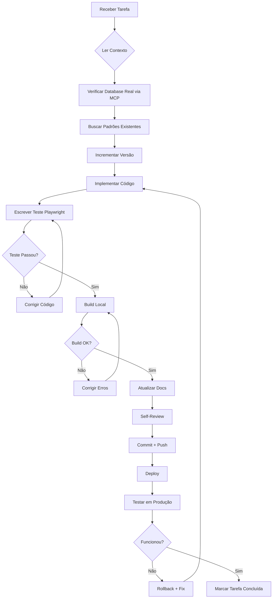

# 🛡️ CHECKLIST DE DESENVOLVIMENTO SEGURO - EAU SYSTEM

**Data de Criação:** 31 de Outubro de 2025
**Status:** 🔴 OBRIGATÓRIO SEGUIR EM TODAS AS IMPLEMENTAÇÕES

---

## 🎯 PROPÓSITO

Este documento define **práticas obrigatórias** para evitar:
- ❌ Erros de implementação
- ❌ Retrabalho
- ❌ Quebra de funcionalidades existentes
- ❌ Tempo perdido
- ❌ Incoerências no sistema

---

## ✅ CHECKLIST PRÉ-DESENVOLVIMENTO (SEMPRE EXECUTAR ANTES)

### 1. **VERIFICAR CONTEXTO COMPLETO**
- [ ] Ler documento de plano relacionado (ex: PLANO_IMPLEMENTACAO_REQUISITOS_CLIENTE.md)
- [ ] Verificar se há dependências com outras funcionalidades
- [ ] Conferir se DATABASE_SCHEMA.md menciona tabelas afetadas
- [ ] Buscar no código existente por padrões similares (usar Grep)

### 2. **VALIDAR DATABASE ATUAL**
- [ ] **SEMPRE** usar `mcp__supabase-novo__list_tables` para verificar schema real
- [ ] **NUNCA** assumir que DATABASE_SCHEMA.md está correto sem validar
- [ ] Verificar constraints existentes (foreign keys, unique, not null)
- [ ] Verificar se RLS policies existem nas tabelas afetadas

### 3. **CRIAR MIGRATION SEGURA**
- [ ] Usar `mcp__supabase-novo__apply_migration` com nome descritivo
- [ ] Incluir `IF NOT EXISTS` / `IF EXISTS` em todos os DDL
- [ ] Testar migration em transação primeiro (BEGIN; ... ROLLBACK;)
- [ ] Criar migration de rollback junto (para reverter se necessário)
- [ ] Documentar o que a migration faz e por quê

### 4. **VERIFICAR IMPACTO NO CÓDIGO**
- [ ] Usar Grep para buscar referências à tabela/campo afetado
- [ ] Listar todos os arquivos que precisarão ser atualizados
- [ ] Verificar services, componentes, types TypeScript
- [ ] Verificar se há queries hard-coded que vão quebrar

### 5. **INCREMENTAR VERSÃO**
- [ ] Atualizar `eau-members/package.json` version (se mudança frontend)
- [ ] Atualizar `eau-backend/package.json` version (se mudança backend)
- [ ] Documentar mudança no CHANGELOG (se existir)

---

## ✅ CHECKLIST DURANTE DESENVOLVIMENTO

### 6. **SEGUIR PADRÕES EXISTENTES**
- [ ] Usar mesma estrutura de pastas do código existente
- [ ] Seguir naming conventions (camelCase, PascalCase conforme padrão)
- [ ] Usar mesmos imports e estrutura de outros arquivos similares
- [ ] Consultar UI_DESIGN_SYSTEM.md antes de criar componentes

### 7. **CÓDIGO DEFENSIVO**
- [ ] Adicionar error handling em todas as funções async
- [ ] Validar inputs antes de processar
- [ ] Usar optional chaining (`?.`) para evitar null/undefined errors
- [ ] Adicionar try-catch em operações críticas

### 8. **COMENTÁRIOS E DOCUMENTAÇÃO**
- [ ] Adicionar JSDoc em funções complexas
- [ ] Comentar lógica não-óbvia
- [ ] Atualizar README se adicionar novos scripts/comandos
- [ ] Atualizar DATABASE_SCHEMA.md após mudanças no banco

---

## ✅ CHECKLIST PÓS-DESENVOLVIMENTO (ANTES DE COMMIT)

### 9. **TESTAR COM PLAYWRIGHT**
- [ ] Escrever teste E2E Playwright para nova funcionalidade
- [ ] Executar teste e validar que passa
- [ ] Testar edge cases (campos vazios, valores inválidos, etc.)
- [ ] Testar em modo incógnito (cache limpo)

### 10. **BUILD E VALIDAÇÃO LOCAL**
- [ ] Backend: `cd eau-backend && npm run build` (deve compilar sem erros)
- [ ] Frontend: `cd eau-members && npm run build` (deve compilar sem erros)
- [ ] Executar `npm run dev` em ambos e testar integração
- [ ] Verificar console do browser (sem erros críticos)

### 11. **REVISÃO DE CÓDIGO (SELF-REVIEW)**
- [ ] Ler diff completo do código antes de commit
- [ ] Verificar se removeu console.logs de debug
- [ ] Verificar se não commitou credenciais ou secrets
- [ ] Verificar se não commitou arquivos temporários (.log, .tmp, etc.)

### 12. **ATUALIZAR DOCUMENTAÇÃO**
- [ ] Atualizar DATABASE_SCHEMA.md se mudou schema
- [ ] Atualizar PLANO_DESENVOLVIMENTO_EAU.md com progresso
- [ ] Atualizar SISTEMA_TESTES_COMPLETO.md com novos testes
- [ ] Marcar tarefas como concluídas nos documentos de plano

---

## 🚨 REGRAS DE OURO (NUNCA QUEBRAR)

### **Database:**
1. **SEMPRE** usar MCP Supabase para operações de banco
2. **NUNCA** executar SQL direto sem validar impacto
3. **SEMPRE** criar migrations com rollback plan
4. **NUNCA** assumir que DATABASE_SCHEMA.md está correto

### **Testing:**
5. **SEMPRE** usar Playwright para testes E2E
6. **NUNCA** marcar tarefa como concluída sem testar
7. **SEMPRE** testar em modo incógnito (cache limpo)
8. **NUNCA** confiar apenas em "funciona na minha máquina"

### **Versioning:**
9. **SEMPRE** incrementar versão após mudanças
10. **NUNCA** fazer deploy sem atualizar versão
11. **SEMPRE** testar com cache limpo após incrementar versão
12. **NUNCA** assumir que usuário verá versão nova sem versioning

### **Code Quality:**
13. **SEMPRE** seguir padrões existentes no código
14. **NUNCA** copiar código sem entender o que faz
15. **SEMPRE** adicionar error handling em código async
16. **NUNCA** deixar console.logs em produção

### **Documentation:**
17. **SEMPRE** atualizar documentação junto com código
18. **NUNCA** fazer mudanças sem documentar
19. **SEMPRE** explicar "por quê" nos commits
20. **NUNCA** fazer commits com mensagens vagas ("fix", "update", etc.)

---

## 📝 WORKFLOW COMPLETO RECOMENDADO



---

## 🎯 EXEMPLO PRÁTICO: Implementar CPD Categories

### ✅ PRÉ-DESENVOLVIMENTO
1. Ler `PLANO_IMPLEMENTACAO_REQUISITOS_CLIENTE.md` → Sprint 1
2. Verificar schema atual: `mcp__supabase-novo__list_tables`
3. Buscar padrões: Grep "cpd_activities" no código
4. Incrementar versão: `eau-members/package.json` → `1.0.0` → `1.0.1`

### ✅ DURANTE DESENVOLVIMENTO
5. Criar migration:
   ```sql
   CREATE TABLE IF NOT EXISTS cpd_categories (
     id UUID PRIMARY KEY DEFAULT gen_random_uuid(),
     name TEXT NOT NULL UNIQUE,
     points_per_hour INTEGER NOT NULL CHECK (points_per_hour IN (1, 2, 3)),
     ...
   );
   ```
6. Aplicar: `mcp__supabase-novo__apply_migration`
7. Validar: `mcp__supabase-novo__list_tables`
8. Implementar backend service seguindo padrão de `cpd.service.ts`
9. Implementar frontend component seguindo padrão de `CPDPage.tsx`

### ✅ PÓS-DESENVOLVIMENTO
10. Escrever teste Playwright: `test-cpd-categories.spec.ts`
11. Executar teste: `npx playwright test test-cpd-categories`
12. Build: `npm run build` em backend e frontend
13. Atualizar DATABASE_SCHEMA.md com nova tabela
14. Self-review do diff
15. Commit: "feat: Add CPD categories with weighted points (1/2/3 per hour)"
16. Deploy + test em produção
17. Marcar Sprint 1 → CPD Categories como ✅

---

## 📊 MÉTRICAS DE QUALIDADE

**Objetivos:**
- ✅ Zero erros de compilação em build
- ✅ 100% dos testes Playwright passando
- ✅ Zero breaking changes em código existente
- ✅ Documentação sempre atualizada
- ✅ Versão incrementada em cada mudança significativa

**Indicadores de Problema:**
- ❌ Build com erros TypeScript
- ❌ Testes falhando
- ❌ Console com errors em browser
- ❌ Documentação desatualizada
- ❌ Usuário reportando cache/versão antiga

---

## 🔄 MANUTENÇÃO DESTE DOCUMENTO

Este documento deve ser atualizado quando:
- Descobrimos novos anti-patterns
- Identificamos erros recorrentes
- Adicionamos novas ferramentas/processos
- Mudamos tecnologias principais

**Última Atualização:** 31 de Outubro de 2025
**Próxima Revisão:** Após cada sprint completo

---

## 📞 DÚVIDAS FREQUENTES

**Q: Posso pular o teste Playwright se for mudança pequena?**
**A:** ❌ NÃO. Mudanças pequenas podem ter impactos inesperados. Sempre testar.

**Q: Preciso incrementar versão para fix de typo?**
**A:** Depende. Se typo está em código (variável, função), SIM. Se está em comentário, não necessariamente.

**Q: DATABASE_SCHEMA.md está diferente do banco. Qual seguir?**
**A:** ✅ SEMPRE o banco real via MCP. Depois atualizar DATABASE_SCHEMA.md.

**Q: Posso usar scripts Node.js para SQL em vez de MCP?**
**A:** ❌ NÃO. Sempre usar MCP Supabase. É o método oficial e rastreável.

**Q: Devo testar em modo normal ou incógnito?**
**A:** ✅ AMBOS. Normal para workflow real, incógnito para validar sem cache.

---

**FIM DO DOCUMENTO**
**Salvar este checklist e consultar SEMPRE antes de começar desenvolvimento**
