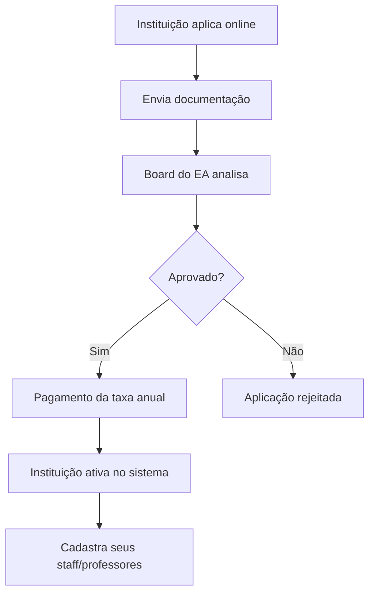

# 📚 Documentação do Sistema de Membership - English Australia

## 🎯 Visão Geral do Modelo de Negócio

O English Australia funciona como uma **associação de instituições de ensino**, não de indivíduos. O modelo é hierárquico:

```
English Australia (Associação)
    ↓
Instituições Membros (Colleges/Schools)
    ↓
Staff/Professores (Usuários do Sistema)
```

## 🏢 1. TIPOS DE MEMBERSHIP (INSTITUCIONAL)

### 1.1 Full Provider Membership
- **Quem pode**: Instituições registradas no CRICOS como ELICOS provider há 12+ meses
- **Taxa**: Variável (base + taxa por site adicional + taxa por semanas de estudantes)
- **Benefícios**: Acesso completo a todos os recursos e benefícios

### 1.2 Associate Provider Membership (Access)
- **Quem pode**: Instituições novas (menos de 12 meses no CRICOS)
- **Taxa**: $2,500/ano + GST
- **Duração**: Máximo 12 meses (depois deve converter para Full)
- **Benefícios**: Acesso limitado

### 1.3 Corporate Affiliate Membership
- **Quem pode**: Empresas que fornecem produtos/serviços ao setor
- **Taxa**: $2,500/ano + GST
- **Benefícios**: Networking e oportunidades de negócio

### 1.4 Professional Affiliate (Institution)
- **Quem pode**: Instituições non-ELICOS (escolas, universidades, etc.)
- **Taxa**: $2,000/ano + GST
- **Benefícios**: Acesso a recursos profissionais

## 👥 2. FLUXO DE CADASTRO E ACESSO

### 2.1 Processo de Adesão da Instituição



### 2.2 Cadastro de Usuários (Staff/Professores)

**IMPORTANTE**: Não existe membership individual direto. Os usuários são:
1. **Criados pela instituição membro**
2. **Vinculados à instituição**
3. **Acessam benefícios através da instituição**

### Fluxo de Cadastro de Usuários:

```
1. Admin da Instituição faz login
2. Acessa "Gerenciar Usuários"
3. Cadastra novo staff/professor:
   - Nome completo
   - Email
   - Cargo/Função
   - Departamento
4. Sistema envia convite por email
5. Usuário cria senha e ativa conta
6. Usuário tem acesso aos recursos permitidos
```

## 💰 3. MODELO DE PAGAMENTO

### 3.1 Quem Paga?
- **APENAS as instituições pagam** taxas anuais
- Staff/professores **NÃO pagam** individualmente
- Acesso dos usuários depende do status de pagamento da instituição

### 3.2 Estrutura de Taxas (Full Provider)
```
Taxa Total = Taxa Base + (Nº Sites × Taxa por Site) + (Student Weeks × Taxa por SW)

Exemplo:
- Taxa Base: $5,000
- 2 sites adicionais: 2 × $1,000 = $2,000
- 10,000 student weeks: 10,000 × $0.50 = $5,000
- TOTAL: $12,000/ano
```

### 3.3 Controle de Pagamento
- Sistema deve verificar status de pagamento da instituição
- Se instituição não pagar: TODOS os usuários perdem acesso
- Período de grace: 30 dias após vencimento

## 🎓 4. SISTEMA CPD (Desenvolvimento Profissional Contínuo)

### 4.1 Como Funciona

**Para Professores/Staff**:
- Registram atividades de desenvolvimento profissional
- Acumulam pontos CPD (meta: 20 pontos/ano)
- Participam de eventos e webinars
- Acessam recursos de aprendizagem

**Para Instituições**:
- Monitoram progresso CPD de seus funcionários
- Recebem relatórios de compliance
- Podem exigir mínimo de pontos CPD

### 4.2 Tipos de Atividades CPD

| Atividade | Pontos/hora |
|-----------|-------------|
| Eventos EA | 2 pontos |
| Webinars | 1 ponto |
| Cursos online | 1 ponto |
| Peer observation | 1 ponto |
| Leitura profissional | 0.5 ponto |

## 🔐 5. HIERARQUIA DE PERMISSÕES

### 5.1 Níveis de Acesso

```
1. Super Admin (English Australia)
   - Controle total do sistema
   - Gerencia todas as instituições
   - Aprova/rejeita memberships

2. Institution Admin (Admin da Escola)
   - Gerencia usuários da sua instituição
   - Visualiza relatórios da instituição
   - Configura eventos internos

3. Staff/Teacher (Professor/Funcionário)
   - Acessa recursos de aprendizagem
   - Registra CPD pessoal
   - Participa de eventos

4. Limited User (Usuário Limitado)
   - Acesso básico a recursos públicos
   - Sem CPD tracking
```

## 📊 6. FUNCIONALIDADES POR TIPO DE USUÁRIO

### 6.1 Para English Australia (Super Admin)

- **Dashboard Geral**:
  - Total de instituições membros
  - Status de pagamentos
  - Estatísticas de CPD global
  - Eventos agendados

- **Gestão de Memberships**:
  - Aprovar/rejeitar aplicações
  - Suspender/reativar instituições
  - Configurar taxas e planos

- **Relatórios**:
  - Financeiro (pagamentos pendentes/recebidos)
  - CPD compliance por instituição
  - Participação em eventos

### 6.2 Para Instituições (Institution Admin)

- **Dashboard Institucional**:
  - Número de staff cadastrados
  - Progresso CPD da equipe
  - Próximos eventos
  - Status do membership

- **Gestão de Usuários**:
  - Adicionar/remover staff
  - Definir permissões
  - Resetar senhas
  - Exportar lista de usuários

- **Relatórios**:
  - CPD individual e coletivo
  - Participação em eventos
  - Certificados emitidos

### 6.3 Para Staff/Professores

- **Meu Perfil**:
  - Informações pessoais
  - Vinculação institucional
  - Histórico CPD

- **CPD Pessoal**:
  - Registrar atividades
  - Ver progresso anual
  - Baixar certificados
  - Planejar desenvolvimento

- **Eventos**:
  - Ver eventos disponíveis
  - Fazer inscrições
  - Acessar materiais

## 🔄 7. CICLO DE VIDA DO MEMBERSHIP

### 7.1 Instituição

```
Aplicação → Aprovação → Pagamento → Ativo → 
→ Renovação Anual → 
→ (ou) Suspensão por não-pagamento →
→ (ou) Cancelamento
```

### 7.2 Usuário Individual

```
Convite da Instituição → Cadastro → Ativo →
→ Uso contínuo (enquanto instituição ativa) →
→ Desativação (se sair da instituição) →
→ Reativação (se mudar para outra instituição membro)
```

## 🚀 8. IMPLEMENTAÇÃO NO SISTEMA

### 8.1 Ajustes Necessários

1. **Tabela `institutions`** (nova):
```sql
CREATE TABLE institutions (
  id UUID PRIMARY KEY,
  name VARCHAR(255) NOT NULL,
  membership_type VARCHAR(50), -- full_provider, associate, corporate, professional
  status VARCHAR(50), -- active, suspended, expired, cancelled
  payment_status VARCHAR(50), -- paid, pending, overdue
  payment_due_date DATE,
  cricos_code VARCHAR(50),
  abn VARCHAR(50),
  created_at TIMESTAMP,
  expires_at DATE
);
```

2. **Modificar tabela `members`**:
```sql
ALTER TABLE members 
ADD COLUMN institution_id UUID REFERENCES institutions(id),
ADD COLUMN user_type VARCHAR(50); -- institution_admin, staff, teacher
```

3. **Tabela `institution_payments`** (nova):
```sql
CREATE TABLE institution_payments (
  id UUID PRIMARY KEY,
  institution_id UUID REFERENCES institutions(id),
  amount DECIMAL(10,2),
  payment_date DATE,
  period_start DATE,
  period_end DATE,
  status VARCHAR(50),
  invoice_number VARCHAR(50)
);
```

### 8.2 Fluxos Principais

**1. Cadastro de Nova Instituição**:
- Admin EA cria instituição no sistema
- Define tipo de membership e taxa
- Sistema gera invoice
- Após pagamento, ativa instituição

**2. Cadastro de Usuário por Instituição**:
- Institution Admin faz login
- Acessa "Gerenciar Staff"
- Adiciona novo usuário com email
- Sistema envia convite automático

**3. Renovação Anual**:
- Sistema notifica 60 dias antes do vencimento
- Gera invoice automática
- Suspende acesso se não pagar em 30 dias

## 📋 9. CHECKLIST DE IMPLEMENTAÇÃO

- [ ] Criar tabela `institutions`
- [ ] Criar tabela `institution_payments`
- [ ] Modificar tabela `members` para incluir `institution_id`
- [ ] Criar página de gestão de instituições
- [ ] Criar fluxo de aplicação para membership
- [ ] Implementar sistema de pagamento/invoices
- [ ] Criar dashboard para Institution Admin
- [ ] Implementar convites por email
- [ ] Criar relatórios por instituição
- [ ] Implementar suspensão automática por não-pagamento
- [ ] Criar sistema de notificações de renovação

## 🎯 10. CONCLUSÃO

O sistema English Australia é **B2B** (business-to-business), não B2C. As instituições são os clientes pagantes, e os usuários individuais (professores/staff) são beneficiários através de suas instituições empregadoras.

### Pontos-Chave:
1. **Membership é institucional**, não individual
2. **Pagamento é feito pela instituição**, não por indivíduos
3. **Usuários são vinculados** a uma instituição
4. **CPD é individual**, mas vinculado à instituição
5. **Acesso depende** do status da instituição

Este modelo garante:
- Receita recorrente previsível
- Controle de qualidade institucional
- Engajamento através das instituições
- Simplificação do processo de cobrança