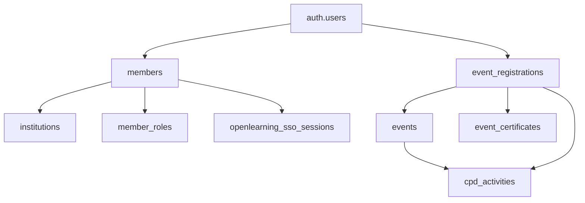

# 🧹 RELATÓRIO DE LIMPEZA DO SISTEMA EAU

**Data:** 31 de Outubro de 2025
**Objetivo:** Limpeza completa de arquivos obsoletos, testes e documentação desatualizada

---

## 📊 ANÁLISE DO SISTEMA

### Arquitetura do Sistema (Mapeamento Completo)

#### 🎯 **CORE ARCHITECTURE**

```
EAU-React/
├── eau-backend/          # Backend Node.js + Express + TypeScript
│   ├── src/
│   │   ├── controllers/  # Controllers para cada módulo
│   │   ├── routes/       # Rotas da API (14 rotas principais)
│   │   ├── services/     # 17 services (alguns duplicados!)
│   │   ├── middleware/   # Auth, permissions
│   │   ├── templates/    # Email templates HTML
│   │   └── index.ts      # Entry point
│   └── dist/             # Build output (MANTER - deploy)
│
├── eau-members/          # Frontend React + TypeScript + Vite
│   ├── src/
│   │   ├── components/   # Componentes reutilizáveis
│   │   ├── features/     # Features modulares (admin, cpd, events, etc)
│   │   ├── services/     # 14 services principais
│   │   ├── stores/       # Zustand stores (authStore)
│   │   ├── routes/       # App routing
│   │   └── App.tsx       # Entry point
│   └── dist/             # Build output (MANTER - deploy)
│
└── ROOT/                 # 281 ARQUIVOS - NECESSITA LIMPEZA URGENTE!
```

#### 🔗 **DATABASE RELATIONSHIPS (Mapeado)**



**Tabelas Principais:**
1. `auth.users` - Autenticação Supabase (5575 usuários)
2. `members` - Membros do sistema (5575 registros)
3. `institutions` - Instituições (129 ativas)
4. `events` - Eventos (397 registrados)
5. `event_registrations` - Registros de eventos
6. `cpd_activities` - Atividades CPD
7. `event_certificates` - Certificados gerados
8. `member_roles` - Sistema de permissões

#### 🚀 **DATA FLOW (Principais Workflows)**

**1. Event Registration Flow:**
```
User registers for event
  → event_registrations (status: confirmed)
  → Email confirmation sent
  → Event ends
  → Auto-generate certificate (CertificateScheduler)
  → Auto-create CPD activity (CPDService)
  → Update registration (certificate_issued: true)
```

**2. Authentication Flow:**
```
User login
  → Supabase Auth (JWT)
  → Load member data
  → Check member_roles
  → Load permissions
  → AuthStore updated
```

**3. OpenLearning SSO Flow:**
```
User clicks "Access OpenLearning"
  → Check if provisioned
  → Generate SSO token (one-time)
  → Create launch data (LTI)
  → Submit form POST
  → OpenLearning auto-login
```

---

## 🗑️ ARQUIVOS IDENTIFICADOS PARA REMOÇÃO

### **CATEGORIA 1: SCRIPTS DE TESTE (REMOVER TODOS - 161 arquivos)**

#### Scripts de Teste (49 arquivos)
```
test-*.js (49 arquivos)
- test-openlearning-*.js
- test-sso-*.js
- test-*.html
- etc.
```

#### Scripts de Verificação (33 arquivos)
```
check-*.js (33 arquivos)
check-*.sql
- check-admin-role.js
- check-cpd-*.js
- check-openlearning-*.js
- etc.
```

#### Scripts de Criação (79 arquivos)
```
create-*.js (79 arquivos)
create-*.sql
- create-test-*.js
- create-auth-users-*.js
- create-member-*.js
- etc.
```

### **CATEGORIA 2: ARQUIVOS DE DADOS DE TESTE (REMOVER TODOS - 15 arquivos)**

```
api-data-*.json (7 arquivos)
*.csv de teste (3 arquivos)
- test-activities.csv
- test-import.csv
- "import/Activities - first 50.csv"
```

### **CATEGORIA 3: DOCUMENTAÇÃO DESATUALIZADA (REVISAR - 40 arquivos)**

#### Documentos de Implementação Concluída (REMOVER - 25 arquivos)
```
CORRECOES_*.md
IMPLEMENTACAO_*.md
PERMISSION_*.md
RELATORIO_*.md
SPRINT_*.md
TESTE_*.md
TEST_*.md
- CORRECOES_APLICADAS.md
- CORRECOES_EVENT_REGISTRATION.md
- IMPLEMENTACAO_ROLES_COMPLETA.md
- PERMISSION_AUDIT_COMPLETE.md
- PERMISSION_FIXES_IMPLEMENTED.md
- PERMISSION_IMPLEMENTATION_COMPLETE.md
- etc.
```

#### Documentos de Sistema Antigo (REMOVER - 5 arquivos)
```
- MIGRATION_GUIDE.md (migração já concluída)
- PROPOSTA_MIGRACAO_SUPABASE_CLOUD.md/html (já migrado)
- RELATORIO_PROBLEMAS_MIGRACAO_CLOUD.md (problemas resolvidos)
```

#### Guias de Setup já Realizados (REMOVER - 10 arquivos)
```
- SETUP_EMAIL.md (email já configurado)
- SETUP_BREVO_EMAIL.md (não usado mais)
- CONFIGURAR_EMAILJS.md (não usado)
- INSTRUCOES_EDGE_FUNCTION.md (edge functions não usadas)
- STORAGE_SETUP.md (storage já configurado)
- SUPABASE_ONLINE_STORAGE.md (duplicado)
```

### **CATEGORIA 4: DUPLICATAS E ARQUIVOS TEMPORÁRIOS (REMOVER - 20 arquivos)**

#### Services Duplicados no Backend
```
eau-backend/src/services/
- openlearningMock.service.ts (REMOVER - usar openlearningCorrect)
- openlearningReal.service.ts (REMOVER - usar openlearningCorrect)
- openlearningWorking.service.ts (REMOVER - usar openlearningCorrect)
- openlearning.service.ts (REMOVER - usar openlearningCorrect)
MANTER: openlearningCorrect.service.ts, openlearningSSO.service.ts
```

#### Scripts de Configuração Obsoletos
```
- configure-smtp*.js (3 arquivos - SMTP já configurado)
- apply-*.js (correções já aplicadas)
- fix-*.js (bugs já corrigidos)
- setup-*.js (setup já completo)
```

### **CATEGORIA 5: LOGS E OUTPUTS (REMOVER - 10 arquivos)**
```
- openlearning-users-*.json
- nul (arquivo vazio)
- log/log_03.png
```

---

## ✅ ARQUIVOS ESSENCIAIS A MANTER

### Documentação Principal (10 arquivos)
```
✅ CLAUDE.md - Instruções do projeto
✅ DATABASE_SCHEMA.md - Schema completo do banco
✅ PLANO_DESENVOLVIMENTO_EAU.md - Roadmap principal
✅ UI_DESIGN_SYSTEM.md - Design system
✅ EASYPANEL_DEPLOYMENT_COMPLETE_GUIDE.md - Guia de deploy
✅ SISTEMA_TESTES_COMPLETO.md - Suite de testes
✅ PLANO_TESTE_EVENTOS_COMPLETO.md - Testes de eventos
✅ OPENLEARNING_SSO_VALIDATED.md - Validação SSO
✅ OPENLEARNING_INTEGRATION_REPORT.md - Integração OL
✅ README.md (se existir)
```

### Arquivos de Configuração (15 arquivos)
```
✅ package.json, package-lock.json (root, backend, frontend)
✅ .env, .env.example (backend, frontend)
✅ .gitignore
✅ .mcp.json
✅ tsconfig.json (backend, frontend)
✅ vite.config.ts (frontend)
✅ Dockerfile (backend, frontend)
✅ docker-compose.yml
```

### Scripts Úteis (5 arquivos)
```
✅ scripts/restart-server.ps1
✅ scripts/backup-database.ps1
✅ extract-database-schema.sql (para atualizar documentação)
```

### Pastas Essenciais
```
✅ eau-backend/src/ (código fonte completo)
✅ eau-backend/dist/ (build para deploy)
✅ eau-members/src/ (código fonte completo)
✅ eau-members/dist/ (build para deploy)
✅ agents/ (documentação de agentes)
✅ docs/ (documentação técnica)
✅ migration/ (se contém migrations importantes)
```

---

## 🎯 PLANO DE LIMPEZA

### **FASE 1: BACKUP (ANTES DE QUALQUER REMOÇÃO)**
```bash
# Criar backup completo antes da limpeza
git add -A
git commit -m "BACKUP: Before major cleanup - all obsolete files"
git push
```

### **FASE 2: REMOÇÃO SEGURA (Por Categoria)**

#### Passo 1: Remover Scripts de Teste (161 arquivos)
```bash
rm test-*.js test-*.html
rm check-*.js check-*.sql
rm create-*.js create-*.sql
rm fix-*.js apply-*.js setup-*.js configure-*.js
```

#### Passo 2: Remover Arquivos de Dados de Teste (15 arquivos)
```bash
rm api-data-*.json
rm test-*.csv
rm openlearning-users-*.json
rm nul
```

#### Passo 3: Remover Documentação Desatualizada (40 arquivos)
```bash
rm CORRECOES_*.md
rm IMPLEMENTACAO_*.md
rm PERMISSION_*.md
rm RELATORIO_*.md (exceto este)
rm SPRINT_*.md
rm TESTE_*.md TEST_*.md
rm MIGRATION_GUIDE.md
rm PROPOSTA_*.md PROPOSTA_*.html
rm SETUP_*.md CONFIGURAR_*.md
rm INSTRUCOES_*.md
rm STORAGE_SETUP.md SUPABASE_ONLINE_STORAGE.md
```

#### Passo 4: Remover Services Duplicados Backend
```bash
cd eau-backend/src/services/
rm openlearningMock.service.ts
rm openlearningReal.service.ts
rm openlearningWorking.service.ts
rm openlearning.service.ts
# MANTER: openlearningCorrect.service.ts, openlearningSSO.service.ts
```

#### Passo 5: Limpar Logs e Temporários
```bash
rm -rf log/
rm -rf .playwright-mcp/ (se não usado)
```

### **FASE 3: ORGANIZAÇÃO**

#### Criar Pasta de Arquivos Históricos (Opcional)
```bash
mkdir _archive_2025_10_31
mv STATUS_*.md _archive_2025_10_31/
mv PLANO_DE_ACAO.md _archive_2025_10_31/ (se desatualizado)
```

---

## 📊 RESUMO DA LIMPEZA

### Antes da Limpeza:
- **Total de arquivos no root:** 281
- **Scripts de teste:** 161
- **Arquivos de dados:** 15
- **Documentação:** 65
- **Outros:** 40

### Depois da Limpeza (Estimado):
- **Total de arquivos no root:** ~30-40
- **Scripts úteis:** 5
- **Documentação essencial:** 10
- **Configuração:** 15
- **Outros necessários:** 10

### **REDUÇÃO ESTIMADA: ~85% dos arquivos (241 arquivos removidos)**

---

## ⚠️ PRECAUÇÕES

1. **SEMPRE fazer backup antes** (commit + push)
2. **Revisar cada arquivo** antes de remover se houver dúvida
3. **Testar o sistema** após limpeza
4. **Manter este relatório** para referência futura

---

## ✅ CHECKLIST DE VALIDAÇÃO PÓS-LIMPEZA

Após a limpeza, validar que o sistema ainda funciona:

- [ ] Backend inicia sem erros (`npm run dev`)
- [ ] Frontend inicia sem erros (`npm run dev`)
- [ ] Login funciona
- [ ] Dashboard carrega
- [ ] Eventos funcionam
- [ ] CPD funciona
- [ ] OpenLearning SSO funciona
- [ ] Emails enviam
- [ ] Build funciona (`npm run build`)
- [ ] Deploy continua funcionando

---

**Status:** Relatório criado - AGUARDANDO APROVAÇÃO PARA EXECUTAR LIMPEZA
